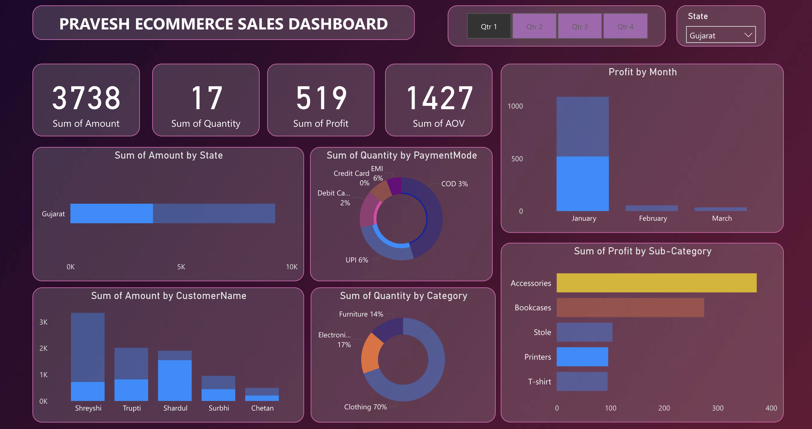

# Ecommerce Analytics Dashboard – Power BI

## Project Overview
This project showcases my expertise in data analysis and visualization using Power BI. I developed an interactive ecommerce dashboard that enables real-time tracking of sales, customer behavior, and profitability. The dashboard is designed for business users to gain actionable insights through dynamic visuals and user-driven filters.

## My Key Skills Demonstrated
- Advanced data visualization and dashboard design in Power BI
- Data modeling and transformation using Power Query
- DAX for custom KPIs and calculated measures
- Translating business requirements into analytical solutions
- Presenting complex data in a clear, actionable format

## Dashboard Highlights
- **Interactive Filters:** Slicers for quarter, state, and customer for focused analysis
- **Dynamic KPIs:** Real-time updates for sales, quantity, profit, and AOV
- **Regional & Time Analysis:** Visuals for state-wise sales and monthly profit trends
- **Customer & Product Insights:** Identify top customers and profitable product categories
- **Payment Analysis:** Understand customer payment preferences

## Business Insights Uncovered
- Seasonal and regional sales trends for targeted marketing
- High-performing product categories and customer segments
- Digital payment adoption patterns
- Actionable recommendations for sales and inventory strategy

## Why This Project Matters
This dashboard demonstrates my ability to turn raw data into business value using Power BI. It highlights my strengths in analytical thinking, data storytelling, and delivering solutions that drive decision-making. 